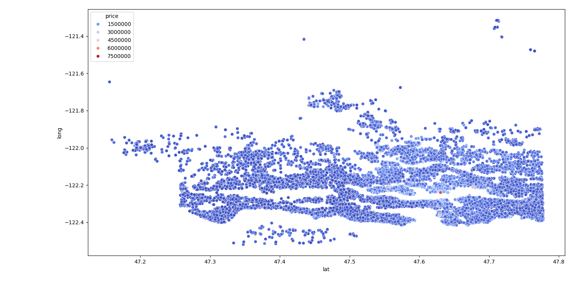
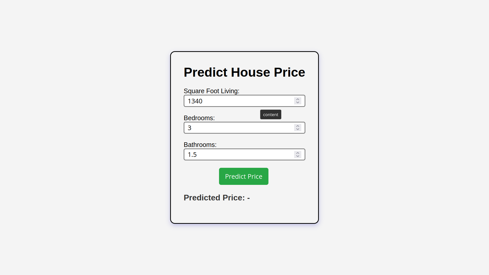

# House Price Prediction


An end-to-end house price prediction web application using a tuned Random Forest model, Django REST API, and vanilla JavaScript frontend.

The app predicts house prices in **King County, Washington** from a trained **Random Forest** regressor. The model is served through a **Django REST API** and consumed by a static, dependency-free web frontend that posts feature values and renders the predicted price.

> 🔗 **Live demo:** <a href="https://sandeepkumarkuanar.github.io/House-pricing-prediction/" target="_blank">On GitHub Pages</a> — the frontend talks to the live API at `https://house-pricing-prediction-fv7l.onrender.com/`.

---

## Table of Contents

- [Overview](#overview)
- [Features](#features)
- [Screenshots](#screenshots)
- [Tech Stack](#tech-stack)
- [Dataset](#dataset)
- [How It Works: The ML Pipeline](#how-it-works-the-ml-pipeline)
- [How a Prediction Request Flows](#how-a-prediction-request-flows)
- [Model Performance](#model-performance)
- [Project Structure](#project-structure)
- [Local Setup](#local-setup)
- [API Reference](#api-reference)
- [Deployment](#deployment)
- [Known Limitations](#known-limitations)
- [Roadmap](#roadmap)
- [Documentation Note](#documentation-note)
- [Author](#author)
- [License](#license)

---

## Overview

This project packages a classic regression problem — predicting the sale price of a house from its structural and geographic features — as a full-stack application:

- **ML core:** a `scikit-learn` Random Forest regressor trained on ~21K King County home sales, with light feature engineering and hyperparameter tuning via `RandomizedSearchCV`.
- **Backend:** a Django REST Framework API that loads the trained model lazily in a background thread and serves predictions as JSON.
- **Frontend:** a single-page vanilla HTML/CSS/JS UI that posts feature values to the API, polls during cold starts, and returns the price estimate.

A user can open the live URL, enter three house details, and receive a price estimate once the (possibly warming-up) model responds.

---

## Features

- **Random Forest regressor tuned with `RandomizedSearchCV`** over `n_estimators`, `max_depth`, `min_samples_leaf`, and `max_features`.
- **Feature engineering** that turns raw columns into more expressive signals:
  - Log transforms on skewed features (`bedrooms`, `bathrooms`, `sqft_living`, `floors`, `sqft_basement`, `yr_built`).
  - A composite `living_quality` feature derived from `view`, `grade`, and `condition` (those three columns are then dropped). The model therefore consumes **16 features** from the 18 the API accepts.
- **Lazy, background model loading** — the model is loaded on first request in a background thread guarded by a lock, so the API does not block on the initial request.
- **Cold-start / task-polling protocol** — while the model loads, the API returns `202` plus a `task_id`; the client polls a status endpoint until the prediction is ready. This is designed for hosts that sleep when idle (e.g., free-tier Render).
- **CORS-enabled JSON API** with a lightweight `/health/` keep-alive endpoint, so the static frontend can be hosted anywhere.
- **Model artifact tracked with Git LFS** (`*.joblib`).
- **Pinned dependencies** in `requirements.txt` for a reproducible environment.

---

## Screenshots

*Ground-truth prices mapped by latitude/longitude (left) and the distribution of engineered features after log transforms (right).*

| Lat–Long price map | Feature distribution after log transform |
|:------------------:|:------------------------------------------:|
|  |  |

**Live web UI:**



---

## Tech Stack

| Layer       | Technology                                                              |
|-------------|-------------------------------------------------------------------------|
| Language    | Python 3.12                                                             |
| ML          | scikit-learn 1.7 (`RandomForestRegressor`), joblib for model persistence |
| Data        | pandas, NumPy, Matplotlib, Seaborn                                      |
| Backend     | Django 5.2, Django REST Framework 3.16, django-cors-headers              |
| Frontend    | Vanilla HTML5, CSS3, JavaScript (no framework)                          |
| Deployment  | Render (Gunicorn as the WSGI server); frontend on GitHub Pages          |
| Versioning  | Git + Git LFS for the model file                                        |

---

## Dataset

Housing data for **King County, WA** (`dataset/kc_final.csv`), sourced from Kaggle.

- **21,613** records × **22** columns
- Target variable: `price` — ranges from **$75,000** to **$7,700,000** (median ≈ **$450,000**)
- Features cover square footage (living, lot, basement, above ground, 15-year offsets), rooms, `waterfront`, `view`, `condition`, `grade`, construction year / renovation year, `zipcode`, `lat` / `long`, and `floors`.

---

## How It Works: The ML Pipeline

The training logic lives entirely in [`main.py`](main.py):

1. **Load & clean** — `dataset/kc_final.csv` is read. The dataset has no missing values or duplicates.
2. **Drop bookkeeping columns** — `id`, `date`, and `Unnamed: 0` carry no predictive signal.
3. **Split** — 80/20 train/test split (`random_state=3`).
4. **Feature engineering (training set)** —
   - Log-transform skewed numerical features (`bedrooms`, `bathrooms`, `sqft_living`, `floors`, `sqft_basement`, `yr_built`) with `np.log(x + 1)`.
   - Build `living_quality = view + grade/2 + condition`, then drop the three source columns, leaving **16 features**.
5. **Baseline** — a default `RandomForestRegressor` is fit and scored (train ≈ 0.98, test ≈ 0.88; the values are noted in `main.py` comments but the baseline model is not what is committed).
6. **Tune** — `RandomizedSearchCV` (`n_iter=10`, `cv=3`, `random_state=42`) over `n_estimators` [100–250], `max_depth` [8–20], `min_samples_leaf` [1–4], and `max_features` ['sqrt', 1.0]. The best estimator is the one committed to the repository.
7. **Persist** — the best estimator is saved with `joblib`, along with the ordered list of training columns.

The committed model (`predictor/ml_models/house_price_model.joblib`) is the **tuned** estimator — verified parameters: `n_estimators=150`, `max_depth=15`, `min_samples_leaf=4`, `max_features=1.0`.

The Django API reproduces the same preprocessing at inference time (see [`views.py`](houseprice_project/predictor/views.py)): `np.log(x + 1)` on the same six columns, `living_quality` composition, dropping `view`/`condition`/`grade`, and column reordering to match `training_columns.json`, guaranteeing train/serve consistency.

---

## How a Prediction Request Flows

1. The user submits **square footage, bedrooms, and bathrooms** in `index.html`. [`scripts/main.js`](scripts/main.js) fills the remaining 15 features with hardcoded example values and POSTs all **18** features as JSON to `/api/predict/`.
2. If the model is already in memory, the API preprocesses the payload and returns `200` with `{"predicted_price": ...}` immediately.
3. If the model has not been loaded yet (cold start), the API kicks off a background thread to load the model, returns `202` with a `task_id`, and queues the prediction against that model.
4. The frontend polls `GET /api/status/<uuid:task_id>/` every 2 seconds (up to ~90 seconds).
5. The background worker runs the same preprocessing as training, calls `model.predict()`, and stores the price; the status endpoint returns `200` with the result (202 while still loading).
6. The frontend renders the price as USD.

The same preprocessing is applied in every path, so warm and cold responses are equivalent.

---

## Model Performance

Scores below were recomputed locally from the **committed tuned model** using the exact preprocessing steps in `main.py`:

| Dataset   | R² Score |
|-----------|----------|
| **Train** | ≈ **0.95** |
| **Test**  | ≈ **0.88** |

There is an **overfitting gap** of roughly **0.06** between train and test — smaller than the untuned baseline reported in `main.py`'s comments (≈ 0.98 / ≈ 0.88), but still present. This is a known limitation of tree ensembles on a dataset of this size and is not hidden.

For a sanity check, the default frontend inputs (sqft_living=1340, 3 bedrooms, 1.5 bathrooms, with the hardcoded defaults for the other features) predict ≈ **$378,620** — verified against the committed model.

These single numbers say nothing about prediction error for individual homes. See [Known Limitations](#known-limitations).

---

## Project Structure

```
House-pricing-prediction/
├── main.py                          # ML pipeline: EDA, feature engineering, training, tuning, save
├── manage.py                        # Django management entrypoint
├── requirements.txt                 # Pinned Python dependencies
├── dataset/
│   └── kc_final.csv                 # King County house sales data (21,613 × 22)
├── plots/                           # EDA / feature-engineering visualizations
├── docs/                            # Screenshots referenced by this README
├── index.html                       # Web frontend (single page)
├── scripts/
│   └── main.js                      # Form handling + API client + polling
├── styles/
│   └── main.css
└── houseprice_project/              # Django project
    ├── db.sqlite3                   # SQLite DB (used by Django admin/migrations only)
    ├── houseprice_project/          # Project config (settings, urls, wsgi/asgi)
    │   ├── settings.py              # Installed apps, CORS, ALLOWED_HOSTS, DEBUG
    │   ├── urls.py                  # Routes: /admin/, /api/, /health/
    │   ├── wsgi.py
    │   └── asgi.py
    └── predictor/                   # The prediction app
        ├── views.py                 # Lazy model load + predict/status/health endpoints
        ├── urls.py
        ├── models.py                # (empty; no ORM models used)
        ├── admin.py
        ├── tests.py                 # (empty; no tests yet)
        ├── migrations/
        └── ml_models/               # Committed model artifacts (joblib via Git LFS)
            ├── house_price_model.joblib
            └── training_columns.json
```

---

## Local Setup

### Prerequisites

- **Python 3.12+**
- **Git LFS** installed (`git lfs install`), required to pull the tracked model file

### 1. Clone & pull the model

```bash
git clone git@github.com:SandeepKumarKuanar/House-pricing-prediction.git
cd House-pricing-prediction
git lfs pull
```

### 2. Install dependencies

```bash
python3 -m venv .venv
source .venv/bin/activate        # Windows: .venv\Scripts\activate
pip install -r requirements.txt
```

### 3. (Optional) Retrain the model

```bash
python main.py
```

This reruns the full pipeline including `RandomizedSearchCV`, which can take **several minutes**. The retrained artifacts land in the **repo root** as `house_price_model.joblib` and `training_columns.json` (both gitignored). Because the application loads its model from `houseprice_project/predictor/ml_models/`, copy them into place to update the served model:

```bash
cp house_price_model.joblib houseprice_project/predictor/ml_models/
cp training_columns.json   houseprice_project/predictor/ml_models/
```

> ⚠️ See [Known Limitations](#known-limitations) — this copy step is a workaround for a save-path mismatch in `main.py`.

### 4. Run the Django API

```bash
python manage.py migrate
python manage.py runserver
```

The API is now available at `http://127.0.0.1:8000/api/`.

### 5. Open the frontend

Open `index.html` in a browser — it is a static page that talks to the API over CORS. If the API is running locally, update `API_BASE_URL` in [`scripts/main.js`](scripts/main.js) to `http://127.0.0.1:8000` before opening the file.

---

## API Reference

Base URL: `https://house-pricing-prediction-fv7l.onrender.com/api/` (or `http://127.0.0.1:8000/api/` locally)

### `POST /api/predict/`

Predicts a house price from feature JSON. The request must include **all 18 features** — the API does not apply defaults for missing fields.

**Request:**
```json
{
  "sqft_living": 1340,
  "bedrooms": 3,
  "bathrooms": 1.5,
  "sqft_lot": 7912,
  "floors": 1.5,
  "waterfront": 0,
  "view": 0,
  "condition": 3,
  "grade": 7,
  "sqft_above": 1340,
  "sqft_basement": 0,
  "yr_built": 1955,
  "yr_renovated": 0,
  "zipcode": 98125,
  "lat": 47.721,
  "long": -122.319,
  "sqft_living15": 1690,
  "sqft_lot15": 7639
}
```

**Example:**
```bash
curl -X POST https://house-pricing-prediction-fv7l.onrender.com/api/predict/ \
  -H "Content-Type: application/json" \
  -d '{"sqft_living": 1340, "bedrooms": 3, "bathrooms": 1.5, "sqft_lot": 7912, "floors": 1.5, "waterfront": 0, "view": 0, "condition": 3, "grade": 7, "sqft_above": 1340, "sqft_basement": 0, "yr_built": 1955, "yr_renovated": 0, "zipcode": 98125, "lat": 47.721, "long": -122.319, "sqft_living15": 1690, "sqft_lot15": 7639}'
```

**Responses:**

| Code | Meaning |
|------|---------|
| `200` | **Warm path** — model already in memory. Immediate answer: `{"predicted_price": 378620.04}` |
| `202` | **Cold path** — model is warming up. Returns a `task_id`; poll `GET /api/status/<task_id>/` |
| `400` | Invalid/missing input or preprocessing error: `{"error": "<message>"}` |

### `GET /api/status/<uuid:task_id>/`

Polls a cold-start prediction. A task is removed from the in-memory store after it is answered once.

| Code | Meaning |
|------|---------|
| `202` | Still loading: `{"status": "loading", "message": "Model is warming up. Please retry."}` |
| `200` | Ready: `{"predicted_price": 378620.04}` |
| `404` | Unknown `task_id` (or already polled): `{"error": "Unknown task_id"}` |
| `500` | Prediction failed: `{"error": "<message>"}` |

### `GET /health/`

Lightweight keep-alive / readiness check (also mapped at `/api/health/`):

```json
{"status": "ok", "model_loaded": true, "model_loading": false}
```

---

## Deployment

There is no infrastructure-as-code in this repository; the service is configured manually in the Render dashboard.

- The **API** is deployed as a Render Web Service (`ALLOWED_HOSTS` already includes the Render hostname in [`settings.py`](houseprice_project/houseprice_project/settings.py)). Long-running commands: build `pip install -r requirements.txt`, start `gunicorn houseprice_project.houseprice_project.wsgi`.
- The **frontend** (`index.html` + `styles/main.css` + `scripts/main.js`) is a static site served on GitHub Pages; it points at the Render API via CORS (`CORS_ALLOW_ALL_ORIGINS = True`).
- On the free tier the service sleeps when idle; the **first request triggers a cold start** (`202` + polling) rather than a timeout.
- Ensure `houseprice_project/predictor/ml_models/house_price_model.joblib` is present after deploy (it is tracked with Git LFS).
- `DEBUG = True` is left on and CORS is wide open — acceptable for this demonstration deployment but not for a public production service. See [Known Limitations](#known-limitations).

---

## Known Limitations

- **Model save-path mismatch (known bug).** [`main.py`](main.py) writes `house_price_model.joblib` and `training_columns.json` to the **repo root**, but the app loads them from `predictor/ml_models/`. Retraining therefore does not update the served model unless the files are copied manually. *Fix is on the [roadmap](#roadmap).*
- **Limited frontend form.** The UI exposes only **3 of the 18 features** the API accepts (`sqft_living`, `bedrooms`, `bathrooms`); the remaining **15** are hardcoded example values in [`scripts/main.js`](scripts/main.js). Internally the model consumes 16 features because `view`/`condition`/`grade` are combined into `living_quality`. The predict endpoint requires all 18 fields and returns an error if any are missing.
- **Cold starts.** The model is not preloaded; the first request after idle triggers a load in a background thread. A startup delay of several seconds is normal, and very slow loads can hit the frontend's ~90s polling cap.
- **In-memory task store.** Cold-start tasks live in a process-local dict. This works for the single-process Render service but breaks with multiple workers or horizontal scaling, and task results are removed after a single status poll.
- **Overfitting gap.** Train R² ≈ 0.95 vs. test R² ≈ 0.88 on the committed tuned model. Test-set R² of ~0.88 is not a guarantee of accurate individual price estimates, and the predictions should **not** be used for real-estate or financial decision-making.
- **scikit-learn version warning.** The committed model was trained with scikit-learn 1.6.1 while `requirements.txt` pins 1.7.2; loading it logs an `InconsistentVersionWarning` (harmless, but a clean retrain with the pinned version removes it).
- **Not production-ready configuration.** `DEBUG = True`, `CORS_ALLOW_ALL_ORIGINS = True`, and a default Django `SECRET_KEY` are committed in `settings.py`. This is fine for a portfolio demo, but these must be changed before any real deployment.
- **No automated tests.** `predictor/tests.py` is empty.

---

## Roadmap

- **Expose the full feature set in the UI** — add inputs for `sqft_lot`, `grade`, `condition`, `zipcode`, etc., instead of hardcoded defaults.
- **Fix the model save-path + wire up a proper retrain flow** so `python main.py` alone updates the served model.
- **Swap the in-memory task store for Redis/Celery** to support multiple workers.
- **Dockerize the app** (Dockerfile + compose) for deployment anywhere, not just Render.
- **Add automated tests + CI** — `predictor/tests.py` is currently empty.
- **Reduce the overfitting gap** — try stronger regularization, more data, or a different algorithm.
- **Pre-warm the model on boot** (e.g., `AppConfig.ready()`) to eliminate cold-start latency for first users.
- **Polish the frontend** — the current three-field page is functional but minimal.

---

## Documentation Note

This README was updated with assistance from OpenCode. The application implementation and code were developed by me; OpenCode was used here only to improve and maintain the project documentation.

---

## Author

**Sandeep Kumar Kuanar**

- GitHub: [SandeepKumarKuanar](https://github.com/SandeepKumarKuanar)
- Contact: [sandeepkumarkuanar.pythonanywhere.com/contact](https://sandeepkumarkuanar.pythonanywhere.com/contact)
- X: [@kuanar_sandeep](https://x.com/kuanar_sandeep)
- Email: `kuanarsandeepkumar@gmail.com`

---

## License

[MIT](LICENSE) © Sandeep Kumar Kuanar