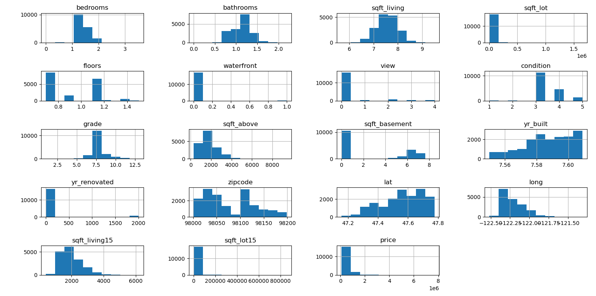

# 🏠 House Price Prediction


An end-to-end machine learning web app that predicts house prices in **King County, Washington** from a trained **Random Forest** model, served through a **Django REST API** with a clean, dependency-free web frontend.

> 🔗 **Live demo:** <a href="https://house-pricing-prediction-fv7l.onrender.com" target="_blank">house-pricing-prediction-fv7l.onrender.com</a>

---

## Table of Contents

- [Overview](#overview)
- [Features](#features)
- [Screenshots](#screenshots)
- [Tech Stack](#tech-stack)
- [Dataset](#dataset)
- [How It Works: The ML Pipeline](#how-it-works-the-ml-pipeline)
- [Model Performance](#model-performance)
- [Project Structure](#project-structure)
- [Local Setup](#local-setup)
- [API Reference](#api-reference)
- [Deployment on Render](#deployment-on-render)
- [Known Issues & Limitations](#known-issues--limitations)
- [Roadmap](#roadmap)
- [Author](#author)
- [License](#license)

---

## Overview

This project takes a classic regression problem — predicting the sale price of a house from its structural and geographic features — and packages it as a complete, production-shaped full-stack application:

- **ML core:** a `scikit-learn` Random Forest regressor trained on ~21K King County home sales, with light feature engineering and hyperparameter tuning.
- **Backend:** a Django REST Framework API that loads the trained model lazily (with graceful cold-start handling) and serves predictions as JSON.
- **Frontend:** a single-page vanilla HTML/CSS/JS UI that posts feature values to the API and renders the predicted price.

Everything is wired together so a user can hit the live URL, enter a few house details, and get a price estimate back in seconds.

---

## Features

- **Random Forest regressor tuned with `RandomizedSearchCV`** (estimators, max depth, min samples, max features).
- **Feature engineering** that turns raw columns into a more expressive signal:
  - Log transforms on skewed features (`bedrooms`, `bathrooms`, `sqft_living`, `floors`, `sqft_basement`, `yr_built`).
  - A composite `living_quality` feature derived from `view`, `grade`, and `condition`.
- **Async model loading** — the model is loaded in a background thread on first request, so the API never blocks while warming up.
- **Cold-start / task polling protocol** — the API returns `202` + a `task_id` while the model loads, and the client polls until the prediction is ready (ideal for free-tier hosts that sleep).
- **CORS-enabled JSON API** with a lightweight `/health/` keep-alive endpoint, so the static frontend can live anywhere.
- **Model artifacts tracked with Git LFS** (`.joblib` files are large binary assets).
- Committed, reproducible Python environment via pinned `requirements.txt`.

---

## Screenshots

*Ground-truth prices mapped by latitude/longitude (left) and the distribution of engineered features after log transforms (right).*

| Lat–Long price map | Feature distribution after log transform |
|-------------------|-------------------------------------------|
|  |  |

**Live web UI:** *drop a screenshot of the deployed site here*

<!--
  TODO: capture a screenshot of https://house-pricing-prediction-fv7l.onrender.com
  and save it as docs/screenshot.png, then uncomment the line below:
  
-->

---

## Tech Stack

| Layer       | Technology                                                              |
|-------------|-------------------------------------------------------------------------|
| Language    | Python 3.12                                                             |
| ML          | scikit-learn 1.7 (RandomForestRegressor), joblib for model persistence  |
| Data        | pandas, NumPy, Matplotlib, Seaborn                                      |
| Backend     | Django 5.2, Django REST Framework 3.16, django-cors-headers             |
| Frontend    | Vanilla HTML5, CSS3, JavaScript (no framework)                          |
| Deployment  | Render (Gunicorn as the WSGI server)                                    |
| Versioning  | Git + Git LFS for model files                                           |

---

## Dataset

Housing data for **King County, WA** (`dataset/kc_final.csv`), sourced from **Kaggle**.

- **21,613** records × **22** columns
- Target variable: `price` — ranges from **\$75,000** to **\$7,700,000** (median ≈ **\$450,000**)
- Features cover square footage (living, lot, basement, above ground, 15-year offsets), rooms, `waterfront`, `view`, `condition`, `grade`, construction year / renovation year, `zipcode`, `lat` / `long`, and `floors`.

---

## How It Works: The ML Pipeline

The training logic lives entirely in [`main.py`](main.py):

1. **Load & clean** — `kc_final.csv` is read; the dataset has no missing values or duplicates.
2. **Drop bookkeeping columns** — `id`, `date`, and `Unnamed: 0` carry no predictive signal.
3. **Split** — 80/20 train/test split (`random_state=3`).
4. **Feature engineering (training set)** —
   - Log-transform skewed numerical features to pull their distributions toward normal.
   - Build `living_quality = view + grade/2 + condition`, then drop the three source columns.
5. **Train** — a `RandomForestRegressor`, first fit untuned to establish a baseline.
6. **Tune** — `RandomizedSearchCV` over `n_estimators`, `max_depth`, `min_samples_leaf`, and `max_features`.
7. **Persist** — the best estimator is saved with `joblib` along with the ordered list of training columns, so the API reproduces identical preprocessing at inference time.

The **Django API** reproduces the exact same preprocessing steps (`np.log(x + 1)` on the same columns, `living_quality` composition, column reordering) before calling `model.predict()`, guaranteeing train/serve consistency.

---

## Model Performance

Honest numbers from the current committed model:

| Dataset   | R² Score |
|-----------|----------|
| **Train** | ≈ **0.98** |
| **Test**  | ≈ **0.88** |

There is a real **overfitting gap** (~0.10 difference between train and test scores) — a known limitation with tree ensembles on a dataset this size. The drop-off is acknowledged rather than hidden; closing it is on the [roadmap](#roadmap). For a single-feature-value sanity check: the sample frontend inputs (sqft_living=1340, 3 beds, 1.5 baths) predict ≈ **\$378,620**.

---

## Project Structure

```
House-pricing-prediction/
├── main.py                          # ML pipeline: train, tune, save the model
├── manage.py                        # Django management entrypoint
├── requirements.txt                 # Pinned Python dependencies
├── dataset/
│   └── kc_final.csv                 # King County house sales data
├── plots/                           # EDA / feature engineering visualizations
│   ├── features-after-logs.png
│   └── lat-long-mapping.png
├── houseprice_project/              # Django project + app
│   ├── db.sqlite3
│   ├── houseprice_project/          # Project config (settings, urls, wsgi/asgi)
│   │   ├── settings.py
│   │   ├── urls.py
│   │   ├── wsgi.py
│   │   └── asgi.py
│   └── predictor/                   # The prediction app
│       ├── views.py                 # predict / status / health endpoints
│       ├── urls.py
│       └── ml_models/               # Committed model artifacts (Git LFS)
│           ├── house_price_model.joblib
│           └── training_columns.json
├── index.html                       # Web frontend (single page)
├── styles/
│   └── main.css
└── scripts/
    └── main.js                      # Form handling + API client + polling
```

---

## Local Setup

### Prerequisites

- **Python 3.12+**
- **Git LFS** installed (`git lfs install`), required to pull the tracked model file

### 1. Clone & pull the model

```bash
git clone git@github.com:SandeepKumarKuanar/House-pricing-prediction.git
cd House-pricing-prediction
git lfs pull
```

### 2. Install dependencies

```bash
python3 -m venv .venv
source .venv/bin/activate        # Windows: .venv\Scripts\activate
pip install -r requirements.txt
```

### 3. (Optional) Retrain the model

```bash
python main.py
```

This runs `RandomizedSearchCV`, which can take **several minutes**. Afterwards the retrained artifacts land in the **repo root** as `house_price_model.joblib` and `training_columns.json`. Because the application loads its model from `houseprice_project/predictor/ml_models/`, copy them into place to update the served model:

```bash
cp house_price_model.joblib houseprice_project/predictor/ml_models/
cp training_columns.json   houseprice_project/predictor/ml_models/
```

> ⚠️ See [Known Issues & Limitations](#known-issues--limitations) — this copy step is a workaround for a save-path mismatch in `main.py`.

### 4. Run the Django API

```bash
python manage.py migrate
python manage.py runserver
```

The API is now available at `http://127.0.0.1:8000/api/`.

### 5. Open the frontend

Simply open `index.html` in a browser — it's a static page that talks to the API over CORS. If the API is running locally, update `API_BASE_URL` in [`scripts/main.js`](scripts/main.js) to `http://127.0.0.1:8000` before opening the file.

---

## API Reference

Base URL: `https://house-pricing-prediction-fv7l.onrender.com/api/` (or `http://127.0.0.1:8000/api/` locally)

### `POST /api/predict/`

Predicts a house price from feature JSON.

**Request:**
```json
{
  "sqft_living": 1340,
  "bedrooms": 3,
  "bathrooms": 1.5,
  "sqft_lot": 7912,
  "floors": 1.5,
  "waterfront": 0,
  "view": 0,
  "condition": 3,
  "grade": 7,
  "sqft_above": 1340,
  "sqft_basement": 0,
  "yr_built": 1955,
  "yr_renovated": 0,
  "zipcode": 98125,
  "lat": 47.721,
  "long": -122.319,
  "sqft_living15": 1690,
  "sqft_lot15": 7639
}
```

**Responses:**

| Code | Meaning |
|------|---------|
| `200` | **Warm path** — model already in memory. Immediate answer: `{"predicted_price": 378620.04}` |
| `202` | **Cold path** — model is warming up. Returns a `task_id`; poll `GET /api/status/<task_id>/` |
| `400` | Invalid request / preprocessing error: `{"error": "<message>"}` |

### `GET /api/status/<uuid:task_id>/`

Polls a cold-start prediction.

| Code | Meaning |
|------|---------|
| `202` | Still loading: `{"status": "loading"}` |
| `200` | Ready: `{"predicted_price": 378620.04}` |
| `404` | Unknown `task_id` |
| `500` | Prediction failed: `{"error": "<message>"}` |

### `GET /health/`

Lightweight keep-alive / readiness check:

```json
{"status": "ok", "model_loaded": true, "model_loading": false}
```

---

## Deployment on Render

The API is deployed as a **Render Web Service**; the frontend is a static page served separately (the rendered `index.html` references the Render API via CORS, which is fully open).

From the Render dashboard:

1. **Build command**
   ```bash
   pip install -r requirements.txt
   ```
2. **Start command**
   ```bash
   gunicorn houseprice_project.houseprice_project.wsgi
   ```
3. **`ALLOWED_HOSTS`** — add your service's domain to [`settings.py`](houseprice_project/houseprice_project/settings.py) (the Render hostname is already there). Debug settings are left on for convenience; disable `DEBUG = True` for production use.
4. **Cold starts** — on the free tier the service sleeps when idle. The first request returns `202` and the frontend polls automatically, so users never see a timeout.
5. **Model file** — ensure `houseprice_project/predictor/ml_models/house_price_model.joblib` is present after build (it's tracked with Git LFS).

---

## Known Issues & Limitations

- **Model save-path mismatch (known bug).** [`main.py`](main.py) writes `house_price_model.joblib` / `training_columns.json` to the **repo root**, but the app loads them from `predictor/ml_models/` (see [`views.py`](houseprice_project/predictor/views.py)). Retraining therefore doesn't update the served model unless you copy the files manually. *Fix is on the [roadmap](#roadmap).*
- **In-memory task store.** Cold-start tasks live in a process-local dict (`_tasks`). This is fine for the single-worker Render service but breaks with multiple workers / horizontal scaling — a Redis task queue is the planned replacement.
- **Overfitting gap.** Train R² ≈ 0.98 vs. test R² ≈ 0.88 indicates the model memorizes the training set better than it generalizes. More data, regularization, or a different algorithm are candidates to close it.
- **scikit-learn version warning.** A joblib file trained with a different scikit-learn patch version logs an `InconsistentVersionWarning` on load (harmless, but a clean retrain with the pinned versions removes it).
- **Limited frontend form.** The UI currently exposes only 3 of the model's 18 features; the rest fall back to hardcoded example values in the JS.

---

## Roadmap

- **Expose the full feature set in the UI** — add inputs for `sqft_lot`, `grade`, `condition`, `zipcode`, etc. instead of hardcoded defaults.
- **Fix the model save-path + wire up a proper retrain flow** so `python main.py` alone updates the deployed model.
- **Swap the in-memory task store for Redis/Celery** to support multiple workers.
- **Dockerize the app** (Dockerfile + compose) for deployment anywhere, not just Render.
- **Add automated tests + CI** — `predictor/tests.py` is currently empty; a GitHub Actions workflow would guard the pipeline.
- **Improve model accuracy** — try XGBoost / tuned models and stronger regularization to shrink the overfitting gap.
- **Pre-warm the model on boot** (e.g., `AppConfig.ready()`) to eliminate cold-start latency for first users.
- **Polish the frontend** — the current single-field page is functional but bare.
- **Reusable ML-project template** — extract the thinking + scripts behind this project into reproducible templates so anyone can scaffold a small ML app like this one.

---

## Author

**Sandeep Kumar Kuanar**

- GitHub: [SandeepKumarKuanar](https://github.com/SandeepKumarKuanar)
- Contact: [sandeepkumarkuanar.pythonanywhere.com/contact](https://sandeepkumarkuanar.pythonanywhere.com/contact)

---

## License

[MIT](LICENSE) © Sandeep Kumar Kuanar